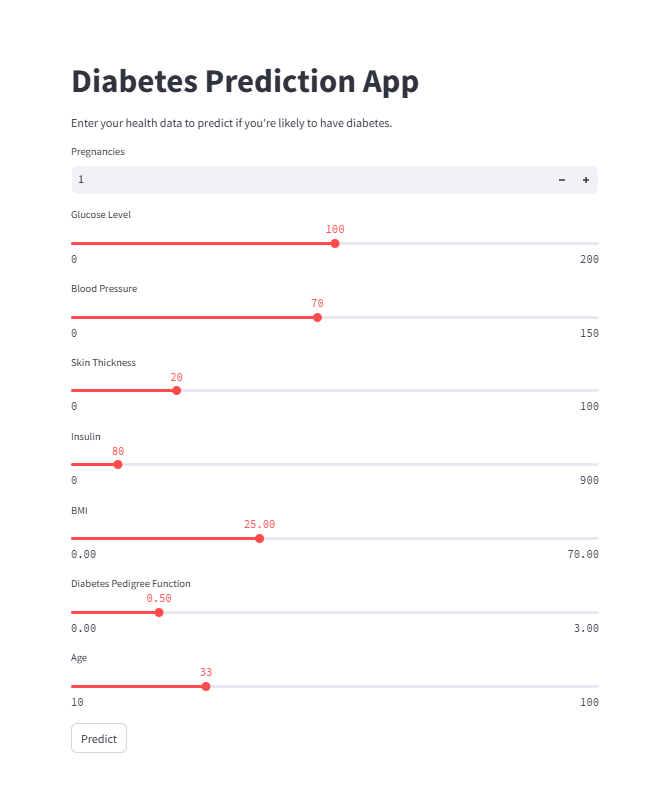

    "# 🩺 Diabetes Prediction App (Streamlit + Machine Learning)\n",
    "\n",
    "This is a web application built using **Streamlit** and a trained **Random Forest Classifier** to predict the risk of diabetes based on user health parameters.\n",
    "\n",
    "---\n",
    "\n",
    "## 🔧 Features\n",
    "\n",
    "- Accepts user input for medical parameters (like Glucose, BMI, Age, etc.)\n",
    "- Predicts diabetes risk using a trained ML model\n",
    "- Shows prediction probability\n",
    "- Simple and interactive UI using Streamlit\n",
    "\n",
    "---\n",
    "\n",
    "## 📸 App Screenshot\n",
    "\n",
    "\n",
    "\n",
    "## 🚀 How to Run This Project\n",
    "\n",
    "### 1. clone the repository\n",
    "\n",
    "```bash\n",
    "git clone https://github.com/YOUR_USERNAME/diabetes-prediction-app.git\n",
    "cd diabetes-prediction-app\n",
    "---\n",
    "\n",
    "### 2. Install requirements\n",
    "pip install -r requirements.txt\n",
    "\n",
    "---\n",
    "### 3. Train the model (creates diabetes_model.pkl)\n",
    "python train_model.py\n",
    "\n",
    "---\n",
    "### 4. Run the Streamlit app\n",
    "streamlit run app.py\n",
    "\n",
    "---\n",
    "📊 Example Inputs\n",
    "Glucose: 120\n",
    "\n",
    "BMI: 28.5\n",
    "\n",
    "Age: 45\n",
    "\n",
    "...\n",
    "\n",
    "The app will show whether you're at high or low risk of diabetes with a probability score.\n",
    "---\n",
    "\n"
 